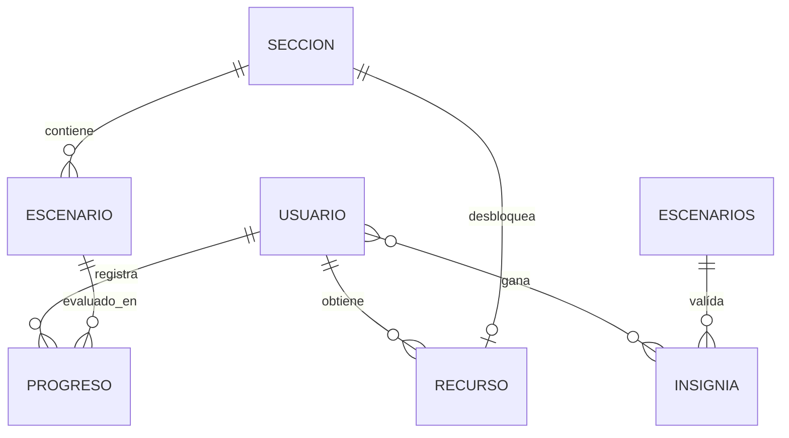
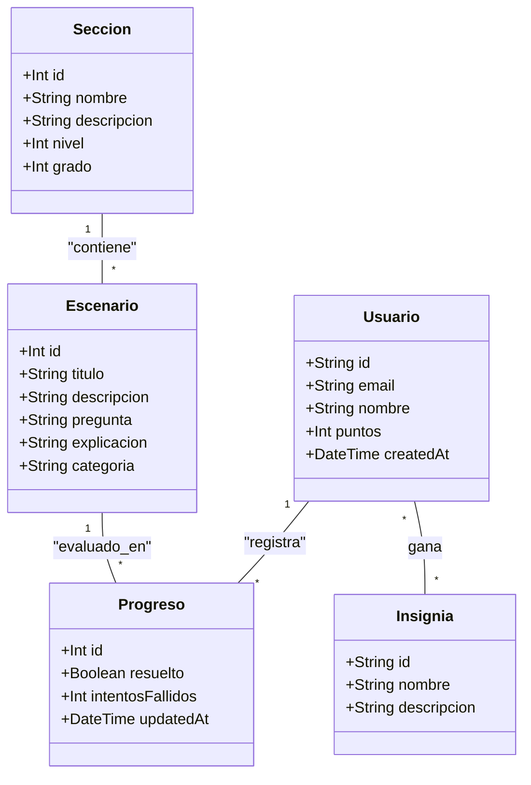

# InnovaLab - Backend Core

Propuesta de estructura para el Back End del proyecto "Aplicación de aprendizaje de Matemática" en InnovaLab. La arquitectura está diseñada para ser escalable, con formato amigable para trabajo en equipo y compatible con entornos de despliegue serverless en Vercel y PostgreSQL en Supabase.

### Arquitectura Monorepo
El proyecto se gestiona bajo una estructura de **Monorepo** utilizando `pnpm workspaces`. Esta configuración permite mantener el código del Back-End y del Front-End en un único repositorio, facilitando la gestión de dependencias compartidas y scripts de automatización desde la raíz del proyecto.

### Estado Actual: "Mock Mode"
El sistema está configurado actualmente para funcionar con datos estáticos incrustados (Mocks). Esto permite probar los endpoints y la navegación sin necesidad de configurar una base de datos externa.

### Roles y Permisos
- **usuario**: Perfil estándar para participantes. Acceso a lecciones y seguimiento de progreso.
- **admin**: Perfil con permisos de edición sobre contenidos (secciones y ejercicios).
- **superadmin**: Perfil de gestión total, incluyendo edición de contenidos y manejo de credenciales/permisos.

## Stack Tecnológico

- **Runtime:** Node.js v24+
- **Framework:** Express.js v5 (Beta/LTS compatible)
- **ORM:** Prisma v7.8.0
- **Gestor de Paquetes:** pnpm
- **Base de Datos:** PostgreSQL (vía Supabase, necesario en estado "Real Mode" )
- **Despliegue:** Vercel

## Instalación y Ejecución

1. Clonar el repositorio y posicionarse en la raíz.

2. Instalar dependencias globales (desde la raíz):
   ```bash
   pnpm install:all
   ```

3. Generar el cliente de Prisma:
    ```bash
    pnpm build
    ```

4. Iniciar el servidor en modo desarrollo:
    ```bash
    pnpm --filter backend dev
    ```

El servidor estará disponible en http://localhost:3001.

## Endpoints Disponibles
- `GET /api/health`: Estado de salud de la API.
- `GET /api/secciones`: Lista de secciones de aprendizaje (Economía Doméstica, Construcción, etc).
- `GET /api/secciones/:id`: Detalle de una sección específica incluyendo sus escenarios.
- `GET /api/secciones/:id/escenarios`: Lista de escenarios para una sección.
- `GET /api/secciones/:id/escenarios/:escenarioId`: Detalle de un escenario con sus ejercicios mockeados.
- `POST /api/usuarios/registro`: Registro de nuevos usuarios o sincronización de perfil.
- `PUT /api/usuarios/perfil`: Actualizaciones de nombre o preferencias del usuario.
- `POST /api/progreso`: Envíar respuestas del usuario, calcula los puntos (Tk) y devuelve el feedback de la IA, si se implementa.

## Transición a base de datos externa
El código cuenta con lógica "dormida" lista para activar.

Para activar la base de datos:

1. Configurar la URL de "Base de Datos" (Supabase u otra) en el archivo `.env`.
2. Ejecutar las migraciones: `pnpm prisma db push`.
3. Poblar la base de datos: `pnpm prisma db seed`.
4. Cambiar la variable `DB_MODE` a `REAL` en el archivo `.env`.

## Estructura del Proyecto

```text
proyecto-matematicas-grupo8/        # Directorio principal del proyecto
├── Back-End/                       # Espacio para desarrollo de lógica
|   ├── (node_modules/)             # Dependencias instaladas por pnpm (no en la nube)
│   ├── prisma/
│   │   ├── schema.prisma           # Modelos de datos
│   │   └── seed.js                 # Script de población
│   ├── src/
│   │   ├── config/
│   │   │   └── prisma.js           # Configuración Prisma y adaptador
│   │   ├── controllers/            # Lógica de negocio
│   │   │   ├── escenario.controller.js
│   │   │   ├── seccion.controller.js
│   │   │   └── usuarios.controller.js
│   │   ├── routes/                 # Definición de endpoints
│   │   │   ├── api.routes.js
│   │   │   ├── seccion.routes.js
│   │   │   └── usuarios.routes.js
│   │   └── app.js                  # Punto de entrada Express
│   ├── .env.example                # Representativo de variables de entorno
│   ├── (.env)                        # Variables de entorno (no en la nube)
│   └── package.json                # Scripts de pnpm para el Back End
├── Front-End/                      # Espacio para desarrollo de interfaz
|   ├── (node_modules/)             # Dependencias instaladas por pnpm (no en la nube)
|   └── package.json                # Scripts de pnpm para el Front End
├── (node_modules/)                 # Dependencias instaladas por pnpm (no en la nube)
├── .gitignore                      # Archivos ignorados por Git
├── package.json                    # Scripts globales de pnpm
├── README.md                       # Descripción general del proyecto
├── pnpm-lock.yaml                  # Configuración de dependencias
└── pnpm-workspace.yaml             # Definición de paquetes del monorepo
```

## Diagrama de Entidad-Relación (ERD)




## Diagrama de Clases



## Scripts Disponibles

- `pnpm dev`: Inicia el servidor en modo desarrollo con nodemon.
- `pnpm start`: Inicia el servidor en modo producción.
- `pnpm build`: Genera el cliente de Prisma (necesario para el despliegue).


*Propuesta desarrollada para el equipo de Back End - InnovaLab 2026*
