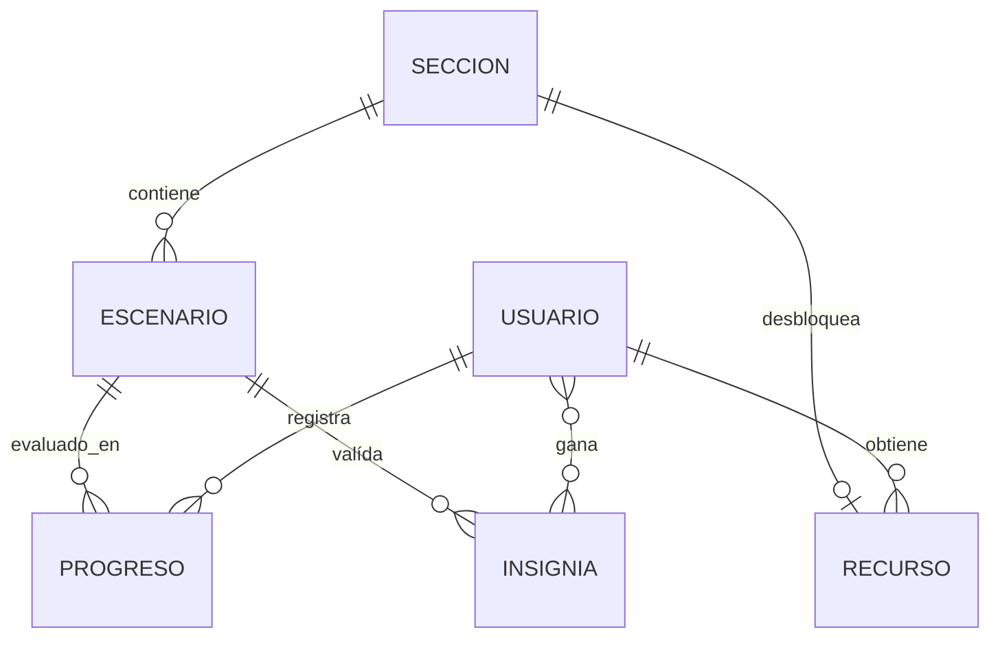
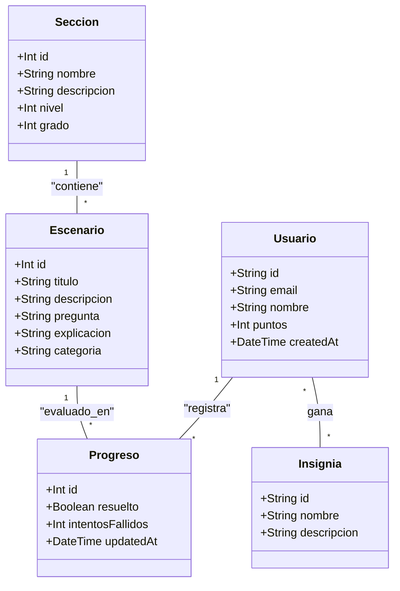

# proyecto-matematicas-grupo8

## MATE+ : Plataforma de Aprendizaje Matemático

Plataforma educativa diseñada para adultos, enfocada en la gamificación y micro-lecciones. Este proyecto utiliza una arquitectura de Monorepo para integrar de forma eficiente el Front-End (React) y el Back-End (Node.js/Express).

### 🚀 Arquitectura Dual-Source (Exclusivo)
El sistema cuenta con una lógica de **Resiliencia Total**. Puede operar en dos modos:

---

### ⚠️ Checkpoint antes del Push
Antes de realizar un `git push` a las ramas de producción o test, es **obligatorio** ejecutar:
`pnpm build`
Esto asegura que no existan errores de compilación ni conflictos con el cliente de Prisma.

---

### 🛠️ Comandos Globales

Desde la raíz del proyecto, utilizá `pnpm` para gestionar ambos mundos:

| Comando             | Descripción                                                                                                                                       |
| :------------------ | :------------------------------------------------------------------------------------------------------------------------------------------------ |
| `pnpm install`      | Instala dependencias en todo el monorepo.                                                                                                         |
| `pnpm dev:all`      | Inicia Front y Back conectados a la **Base de Datos real**.                                                                                       |
| `pnpm dev:all-mock` | Inicia Front y Back en **Modo Offline (CSV + Auth Simulado)**. *Nota: Este comando fuerza `DATA_SOURCE=MOCK` ignorando lo definido en el `.env`.* |
| `pnpm build:back`   | Regenera el cliente de Prisma (necesario si cambia el schema).                                                                                    |
| `pnpm build`        | Genera la versión de producción para despliegue.                                                                                                  |

---

### 📦 Estructura del Monorepo

```text
proyecto-matematicas-grupo8/
├── Back-End/               # API Express + Prisma ORM
│   ├── data/               # Archivos CSV para el modo Mock
│   ├── prisma/             # Esquemas de base de datos
│   └── src/                # Controladores, Rutas y Lógica de IA (Gemini)
├── Front-End/              # React + Bootstrap (Vite)
│   ├── src/context/        # Auth Bridge y estados globales
│   └── src/pages/          # Vistas y flujos de usuario
└── package.json            # Scripts de orquestación pnpm
```

---

### 🔐 Autenticación y Seguridad

El proyecto utiliza **Supabase Auth** para la gestión de usuarios. Si las llaves de Supabase no están configuradas en el `.env`, el sistema activa un modo de bypass que permite:
- Login con cualquier contraseña para cuentas como `admin@test.com` o `invitado@test.com`.
- Persistencia simulada en `Back-End/data/usuarios.csv`.

### 🤖 Integración con IA
Se utiliza la API de **Gemini 1.5 Flash** para proporcionar feedback pedagógico en tiempo real ante errores en los ejercicios. Si la API Key no está presente, el sistema utiliza un fallback con explicaciones estáticas predefinidas.

---

### 👥 Equipo
Desarrollado para la Simulación **Innova Lab 2026**.
*Identidad Git: motero / cesar*

## Instalación y Ejecución

1. Clonar el repositorio y posicionarse en el directorio raíz para ejecutar los siguientes comandos:

2. Instalar dependencias globales:
   `pnpm install:all`

3. Generar el cliente de **Prisma**:
   `pnpm build:back`

4. Iniciar el servidor en modo desarrollo (elegí según tu necesidad):

   **Modo Local (Mock con CSV):** Ideal para el sub-equipo de Front-End.
   `pnpm dev:local`

   **Modo Database (Supabase):** Para pruebas de persistencia real.
   `pnpm dev:db`

*Nota: El comando `pnpm dev` estándar utilizará la fuente definida en la variable `DATA_SOURCE`, configurable como `DB` o `MOCK`, en tu archivo `.env` para simplificar el uso en desarrollo.*

### Integración con Gemini AI (Google Studio)
Para la generación de feedback pedagógico, la API utiliza el modelo **Gemini 2.5 Flash**. Por motivos de seguridad y para evitar el agotamiento de cuotas compartidas, **cada desarrollador debe configurar su propia API Key**.

**Pasos para obtener la Key:**
1. Ingresá al [Google AI Studio](https://aistudio.google.com/) de tu cuenta Google.
2. Generá una nueva **API Key** (podés hacerlo en el plan gratuito, no pide requisitos).
3. Copiá la llave y pegala en tu archivo `.env` local en la variable `GOOGLE_API_KEY`. (podés crear este archivo basandote en el `.env.example` que se incluye en el repositorio)

# Gemini API Key
`GOOGLE_API_KEY="api_key"`
En tu archivo `.env` de la carpeta `/Back-End`, cambiá lo que está **dentro** de las comillas por tu propia Key.

**Límites de la Capa Gratuita:**
- **RPM (Requests Per Minute):** 15 solicitudes.
- **RPD (Requests Per Day):** 1,500 solicitudes.
- **TPM (Tokens Per Minute):** 1,000,000 tokens.

**Mecanismo de Resiliencia (Fallback):**
En caso de que no haya una Key configurada o se excedan los límites de cuota, el sistema activará automáticamente un modo de respaldo. En lugar de fallar, el servidor responderá utilizando la explicación técnica predefinida en el campo `explicacion` del módulo CSV de **Escenarios**.

### 📂 Requisitos para Modo Mock (Plug & Play)
Para que el sistema de respaldo funcione correctamente en desarrollo local, es **imprescindible** que la carpeta `Back-End/data/` cuente con los archivos de tablas base:
- `usuarios.csv`: Tabla maestra de usuarios (mínimo requerido para login/registro simulado).
- `auditoria.csv`: Registro de acciones del sistema.

Si estos archivos no están presentes en el directorio designado, el servidor Mock no podrá inicializar la persistencia local.

### Auditoría en Modo Mock
Las acciones de escritura (POST, PUT, DELETE) se registran automáticamente en el archivo `Back-End/data/auditoria.csv`. Esto permite simular la persistencia de logs de auditoría sin depender de una base de datos externa.

Para limpiar el historial de auditoría local y empezar una sesión de pruebas limpia, ejecutá desde la raíz:
`pnpm clean:audit`

### Pruebas de Endpoints (REST Client)
Para facilitar el testeo sin salir de VS Code, se incluye un archivo `requests.http` en la carpeta de scripts que se puede modificar segun las necesidades.
1. Instalá la extensión **REST Client** de Huachao Mao en VS Code.
2. Abrí el archivo `requests.http`.
3. Hacé clic en el texto `Send Request` que aparece sobre cada endpoint para ejecutarlo y ver la respuesta en tiempo real.

El servidor estará disponible en http://localhost:3001.

## Endpoints Disponibles

### Salud de API
- `GET /api/health`: Estado de salud de la API y timestamp.

### Endpoints de la API

| Módulo         | Método | Endpoint                              | Descripción                            |
| :------------- | :----- | :------------------------------------ | :------------------------------------- |
| **Salud**      | GET    | `/api/health`                         | Estado del servidor                    |
| **Usuarios**   | POST   | `/api/usuarios/registro`              | Sincronización con Auth                |
| **Usuarios**   | POST   | `/api/usuarios/login`                 | Login local (Modo Mock)                |
| **Usuarios**   | PUT    | `/api/usuarios/perfil`                | Actualiza datos personales             |
| **Usuarios**   | GET    | `/api/usuarios`                       | Lista los Usuarios                     |
| **Secciones**  | GET    | `/api/secciones`                      | Lista las Secciones                    |
| **Secciones**  | GET    | `/api/secciones/:id`                  | Trae una Sección completa              |
| **Secciones**  | POST   | `/api/secciones`                      | Crea una Sección nueva (Admin)         |
| **Secciones**  | PUT    | `/api/secciones/:id`                  | Edita una Sección (Admin)              |
| **Secciones**  | DELETE | `/api/secciones/:id`                  | Eliminar una Sección (Admin)           |
| **Escenarios** | GET    | `/api/secciones/:sId/escenarios`      | Lista los Escenarios de esa Sección    |
| **Escenarios** | GET    | `/api/secciones/:sId/escenarios/:eId` | Detalles del Escenario                 |
| **Escenarios** | POST   | `/api/secciones/:sId/escenarios`      | Crea un Escenario nuevo (Admin)        |
| **Escenarios** | PUT    | `/api/secciones/:sId/escenarios/:eId` | Edita el Escenario (Admin)             |
| **Escenarios** | DELETE | `/api/secciones/:sId/escenarios/:eId` | Elimina el Escenario (Admin)           |
| **Progreso**   | POST   | `/api/progreso`                       | Registra solución y gana Tk            |
| **Progreso**   | GET    | `/api/progreso/usuario/:uid`          | Historial del usuario                  |
| **Auditoría**  | GET    | `/api/logs`                           | Trazabilidad de actividades (SupAdmin) |

## Estructura del Proyecto

```bash
proyecto-matematicas-grupo8/        # Directorio principal
├── Back-End/                       # Lógica de servidor
│   ├── prisma/
│   │   ├── schema.prisma           # Modelos de datos (PostgreSQL)
│   │   └── seed.js                 # Datos iniciales para la DB
│   ├── scripts/                    # Scripts de utilidad en tests del desarrollo
│   ├── src/
│   │   ├── config/
│   │   │   ├── mock-database.js    # Inicialización del servidor modular local
│   │   │   ├── prisma.js           # Inicialización del Cliente Prisma
│   │   │   └── supabase.js         # Inicialización del Cliente Supabase
│   │   ├── controllers/            # Controladores de ruta (Lógica de negocio)
│   │   ├── services/               # Lógica de aplicación y cálculos complejos
│   │   ├── middlewares/            # Auth, Logging y Filtros de seguridad
│   │   ├── routes/                 # Definición de rutas Express
│   │   ├── validators/             # Validación de esquemas de datos (Zod/Express-Validator)
│   │   ├── exceptions/             # Manejo de errores personalizados
│   │   ├── utils/                  # Funciones de utilidad y constantes
│   │   └── app.js                  # Punto de entrada de la aplicación
│   ├── .env.example                # Plantilla de variables de entorno
│   └── package.json                # Scripts y dependencias del Back End
├── Front-End/                      # Espacio para desarrollo de interfaz
├── pnpm-workspace.yaml             # Configuración del monorepo
└── README.md                       # Documentación general
```

## Diagrama de Entidad-Relación (ERD)



## Diagrama de Clases


