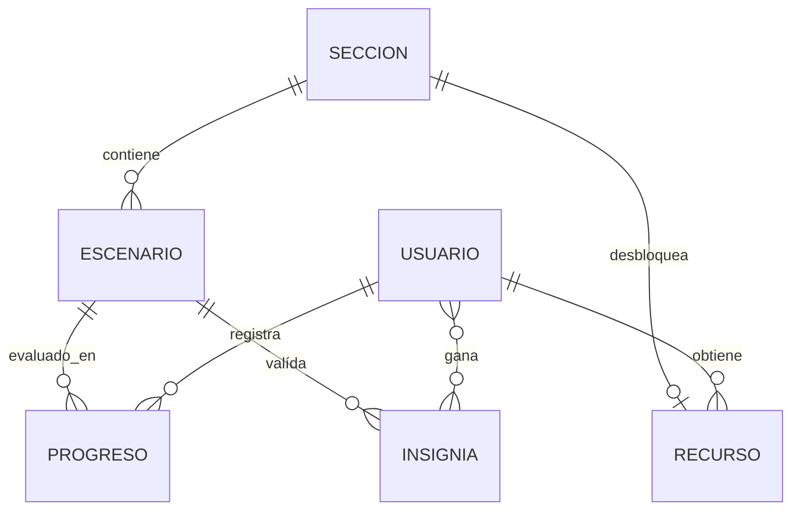
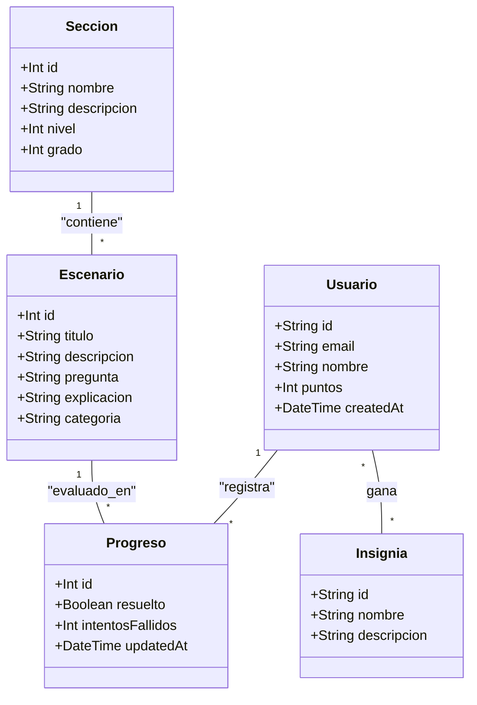

# proyecto-matematicas-grupo8


## Front End Core

# Comandos útiles

Instalar dependencias

Desde la carpeta raíz

# Proyecto

Web app realizada con React y Bootstrap

## Tecnologías

    UI: React + React Router DOM
    Estilos: Bootstrap
    Formularios: React Hook Form + Zod
    Estado cliente: Zustand (Context)
    Peticiones: Axios

## Estructura de carpetas

```
src/
├── components/           # Componentes reutilizables
│   ├── ui/               # Componentes UI básicos
│   │   ├── Button.jsx
│   │   ├── Icon.jsx
│   │   ├── Image.jsx
│   │   └── Input.jsx
│   ├── layout/           # Componentes de estructura de página
│   │   ├── Header.jsx
│   │   ├── Footer.jsx
│   │   └── Sidebar.jsx
│   └── widgets/          # Componentes complejos o secciones
│       ├── ProductCard.jsx
│       ├── UserProfile.jsx
│       └── SearchBar.jsx
├── pages/                # Páginas principales
│   ├── Home.jsx
│   ├── Login.jsx
│   ├── Registro.jsx
│   ├── About.jsx
│   └── Contact.jsx
└── assets/               # Archivos estáticos (imágenes, iconos, etc.)
```


## Backend Core

Propuesta inicial de estructura para el Back End del proyecto "Aplicación de aprendizaje de Matemática" en **InnovaLab**. La arquitectura está diseñada para ser escalable, profesional y compatible con entornos de despliegue serverless en **Vercel** y **PostgreSQL** en **Supabase**.

### Arquitectura Monorepo
El proyecto se gestiona bajo una estructura de **Monorepo** utilizando `pnpm workspaces`. Esta configuración permite mantener el código del Back-End y del Front-End en un único repositorio, facilitando la gestión de dependencias compartidas y scripts de automatización desde la raíz del proyecto.

### Integración de Datos
El sistema cuenta con una arquitectura de datos dual. Puede operar conectado a una base de datos **PostgreSQL** (**Supabase**) o mediante un **Mock Server** que consume archivos `.csv` locales, permitiendo el desarrollo sin dependencias de red o configuraciones de base de datos e integración con CLI externos.

### Roles y Permisos
- **usuario:** Perfil estándar para participantes. Acceso a escenarios interactivos y seguimiento de progreso.
- **admin:** Perfil con permisos de edición sobre contenidos (Secciones y Escenarios).
- **superadmin:** Perfil de gestión total, incluyendo edición de contenidos y manejo de credenciales/permisos.

## Stack Tecnológico

- **Runtime:** **Node.js** v24+
- **Framework:** **Express.js** v5 (Beta/LTS compatible)
- **ORM:** **Prisma** v6.4.1 (Stable - Native Engines)
- **Gestor de Paquetes:** `pnpm`
- **Base de Datos:** **PostgreSQL** (vía **Supabase**)
- **Despliegue:** **Vercel**

## Instalación y Ejecución

1. Clonar el repositorio y posicionarse en el directorio raíz para ejecutar los siguientes comandos:

2. Instalar dependencias globales:
   `pnpm install:all`

3. Generar el cliente de **Prisma**:
   `pnpm build:back`

4. Iniciar el servidor en modo desarrollo (elegí según tu necesidad):

   **Modo Local (Mock con CSV):** Ideal para el sub-equipo de Front-End.
   `pnpm dev:local`

   **Modo Database (Supabase):** Para pruebas de persistencia real.
   `pnpm dev:db`

*Nota: El comando `pnpm dev` estándar utilizará la fuente definida en la variable `DATA_SOURCE`, configurable como `DB` o `MOCK`, en tu archivo `.env` para simplificar el uso en desarrollo.*

### Integración con Gemini AI (Google Studio)
Para la generación de feedback pedagógico, la API utiliza el modelo **Gemini 2.5 Flash**. Por motivos de seguridad y para evitar el agotamiento de cuotas compartidas, **cada desarrollador debe configurar su propia API Key**.

**Pasos para obtener la Key:**
1. Ingresá al [Google AI Studio](https://aistudio.google.com/) de tu cuenta Google.
2. Generá una nueva **API Key** (podés hacerlo en el plan gratuito, no pide requisitos).
3. Copiá la llave y pegala en tu archivo `.env` local en la variable `GOOGLE_API_KEY`. (podés crear este archivo basandote en el `.env.example` que se incluye en el repositorio)

# Gemini API Key
`GOOGLE_API_KEY="api_key"`
En tu archivo `.env` de la carpeta `/Back-End`, cambiá lo que está **dentro** de las comillas por tu propia Key.

**Límites de la Capa Gratuita:**
- **RPM (Requests Per Minute):** 15 solicitudes.
- **RPD (Requests Per Day):** 1,500 solicitudes.
- **TPM (Tokens Per Minute):** 1,000,000 tokens.

**Mecanismo de Resiliencia (Fallback):**
En caso de que no haya una Key configurada o se excedan los límites de cuota, el sistema activará automáticamente un modo de respaldo. En lugar de fallar, el servidor responderá utilizando la explicación técnica predefinida en el campo `explicacion` del módulo CSV de **Escenarios**.

### Auditoría en Modo Mock
Cuando el servidor corre en modo **Local** (`DATA_SOURCE=MOCK`), las acciones de escritura (POST, PUT, DELETE) se registran automáticamente en el archivo `Back-End/data/auditoria.csv`. Esto permite simular la persistencia de logs de auditoría sin depender de una base de datos externa.

Para limpiar el historial de auditoría local y empezar una sesión de pruebas limpia, ejecutá desde la raíz:
`pnpm clean:audit`

### Pruebas de Endpoints (REST Client)
Para facilitar el testeo sin salir de VS Code, se incluye un archivo `requests.http` en la carpeta de scripts que se puede modificar segun las necesidades.
1. Instalá la extensión **REST Client** de Huachao Mao en VS Code.
2. Abrí el archivo `requests.http`.
3. Hacé clic en el texto `Send Request` que aparece sobre cada endpoint para ejecutarlo y ver la respuesta en tiempo real.

El servidor estará disponible en http://localhost:3001.

## Endpoints Disponibles

### Salud de API
- `GET /api/health`: Estado de salud de la API y timestamp.

### Usuarios (Auth & Perfil)
- `POST /api/usuarios/registro`: Registra un nuevo usuario o sincroniza el perfil (vía uid de **Supabase**).
- `PUT /api/usuarios/perfil`: Actualiza nombre o preferencias del usuario.

### Secciones y Escenarios
- `GET /api/secciones`: Lista todas las secciones (Economía Doméstica, Construcción, etc).
- `GET /api/secciones/:id`: Detalle de una sección específica incluyendo sus escenarios.
- `GET /api/secciones/:seccionId/escenarios`: Lista de escenarios para una sección.
- `GET /api/secciones/:seccionId/escenarios/:escenarioId`: Detalle de un escenario con sus opciones de respuesta.

### Progreso y Gamificación
- `POST /api/progreso`: Registra la respuesta del usuario, calcula puntos (Tk) y actualiza el progreso.
- `GET /api/progreso/usuario/:uid`: Obtiene el historial de ejercicios resueltos por el usuario.

## Estructura del Proyecto

```bash
proyecto-matematicas-grupo8/        # Directorio principal
├── Back-End/                       # Lógica de servidor
│   ├── prisma/
│   │   ├── schema.prisma           # Modelos de datos (PostgreSQL)
│   │   └── seed.js                 # Datos iniciales para la DB
│   ├── scripts/                    # Scripts de utilidad en tests del desarrollo
│   ├── src/
│   │   ├── config/
│   │   │   ├── mock-database.js    # Inicialización del servidor modular local
│   │   │   ├── prisma.js           # Inicialización del Cliente Prisma
│   │   │   └── supabase.js         # Inicialización del Cliente Supabase
│   │   ├── controllers/            # Controladores de ruta (Lógica de negocio)
│   │   ├── services/               # Lógica de aplicación y cálculos complejos
│   │   ├── middlewares/            # Auth, Logging y Filtros de seguridad
│   │   ├── routes/                 # Definición de rutas Express
│   │   ├── validators/             # Validación de esquemas de datos (Zod/Express-Validator)
│   │   ├── exceptions/             # Manejo de errores personalizados
│   │   ├── utils/                  # Funciones de utilidad y constantes
│   │   └── app.js                  # Punto de entrada de la aplicación
│   ├── .env.example                # Plantilla de variables de entorno
│   └── package.json                # Scripts y dependencias del Back End
├── Front-End/                      # Espacio para desarrollo de interfaz
├── pnpm-workspace.yaml             # Configuración del monorepo
└── README.md                       # Documentación general
```

## Diagrama de Entidad-Relación (ERD)



## Diagrama de Clases


